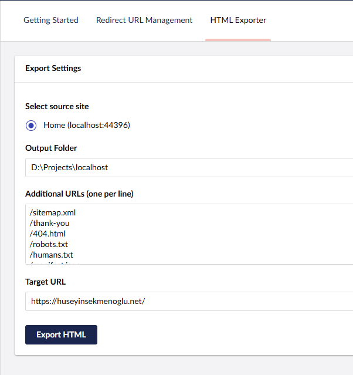

# Sekmen.StaticSiteGenerator & Umbraco.Community.HtmlExporter

Monorepo containing:
- `Sekmen.StaticSiteGenerator` – Core engine that crawls a dynamic Umbraco / HTML site and exports a static snapshot.
- `Umbraco.Community.HtmlExporter` – Umbraco backoffice dashboard + API that wraps the core engine so editors can trigger exports.



## Why
Quickly host Umbraco content on cheap / global static hosting providers (GitHub Pages, Netlify, Cloudflare Pages, Azure Static Web Apps, S3 + CloudFront) for speed, cost and resilience, while continuing to author content in Umbraco.

---
## Packages
| Package | NuGet | Description |
|---------|-------|-------------|
| Core | `Sekmen.StaticSiteGenerator` | Programmatic API to export a site to a folder. |
| Plugin | `Umbraco.Community.HtmlExporter` | Adds a backoffice dashboard + secured API endpoints. |

---
## Core Highlights
- Discovers pages from `sitemap.xml` + internal `<a>` links
- Inject additional URLs not in navigation
- Downloads assets (CSS, JS, images, inline style background images)
- Avoids unnecessary re-download (HEAD + size compare)
- Rewrites absolute + root-relative URLs to a target static domain
- Normalizes certain Umbraco path/name patterns
- Produces folder-style structure with `index.html` where needed

See detailed API docs inside the core package's own `readme.md` (packed with the NuGet). Quick taste:
```csharp
await Functions.ExportWebsite(new HttpClient(), new ExportCommand(
    SiteUrl: "example.com",
    AdditionalUrls: new []{"/404"},
    TargetUrl: "https://static.example.com/",
    OutputFolder: "./out"
));
```
Deploy the `./out` directory.

---
## Umbraco Plugin Overview
After installing `Umbraco.Community.HtmlExporter` into your Umbraco project:
- A dashboard appears (Content section) with controls for SiteUrl, Additional Urls, Target Url, and Output Folder.
- Backend endpoints (secured):
  - `GET /umbracocommunityhtmlexporter/api/v1.0/get-data`
  - `POST /umbracocommunityhtmlexporter/api/v1.0/export-website`
- The POST endpoint mirrors the `ExportCommand` parameters (multipart/form-data).

### Typical Workflow
1. Editors publish content as normal.
2. Editor opens the dashboard, sets target static domain + output folder path on the server (or mounted share / artifact folder).
3. Click Export → Background HTTP calls crawl & write files.
4. CI/CD or scheduled task syncs exported folder to static host.

---
## Installation
### Core
```
dotnet add package Sekmen.StaticSiteGenerator
```
### Plugin (in an Umbraco project)
```
dotnet add package Umbraco.Community.HtmlExporter
```
Build the project; MSBuild targets will auto restore & build the embedded client assets (via NPM in `Client`).

---
## Configuration Notes
Currently the export logic:
- Forces `https://` when constructing the source URL from `SiteUrl`.
- Performs simple string replacements for rewriting. (Future: DOM-aware rewriting.)
Ensure `TargetUrl` ends with a trailing slash for clean concatenation.

---
## Limitations
- Requires a reachable `sitemap.xml` (enhancement planned for optional mode)
- Sequential crawling (no configurable parallelism yet)
- Basic asset change detection (size only)
- No include/exclude pattern filters yet
- Does not render JS / SPA routes

Roadmap ideas tracked inside the core package README.

---
## Local Development
1. Clone repo & restore
```
git clone https://github.com/sekmenhuseyin/Sekmen.StaticSiteGenerator.git
cd Sekmen.StaticSiteGenerator
 dotnet restore
```
2. Build all
```
dotnet build
```
3. (Optional) Manually build plugin client
```
cd Umbraco.Community.HtmlExporter/Client
npm install
npm run build
```
4. Launch `UmbracoTestProject` to experiment.

---
## Packaging
```
dotnet pack -c Release
```
Produces `.nupkg` files for both packages with embedded README + icon.

---
## Contributing
PRs welcome:
1. Fork & branch
2. Implement / test
3. Update relevant README section(s)
4. Open PR with context (screenshots for UI changes)

Please keep dependencies minimal and avoid introducing heavy frameworks.

---
## License
MIT © Hüseyin Sekmenoğlu

---
## Quick Links
- Issues / Discussions: Use GitHub repository
- NuGet: Search for package IDs above
- Screenshot: See `Screenshot.png` in repo

---
Happy exporting! 🎉
